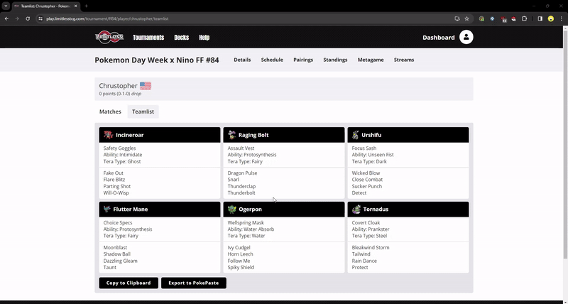

<h1 align="center">
  
  PokéPaste Exporter
</h1>

<table align="center">
  <thead>
    <tr>
      <th align="center">&nbsp;v1.3.1&nbsp;</th>
      <th align="center">&nbsp;Install on <a href="https://chromewebstore.google.com/detail/pokepaste-exporter/eehioifimidcjcdlaehajhdeaekmmdne?hl=en&authuser=0)">Chrome</a> · <a href="https://addons.mozilla.org/en-US/firefox/addon/showdown-team-sheet-viewer/">Firefox</a></th>
    </tr>
  </thead>
</table>

 
 

An extension that enables you to export your opponent's team from Pokémon Showdown and Limitless. Also fixes images on PokéPaste!

